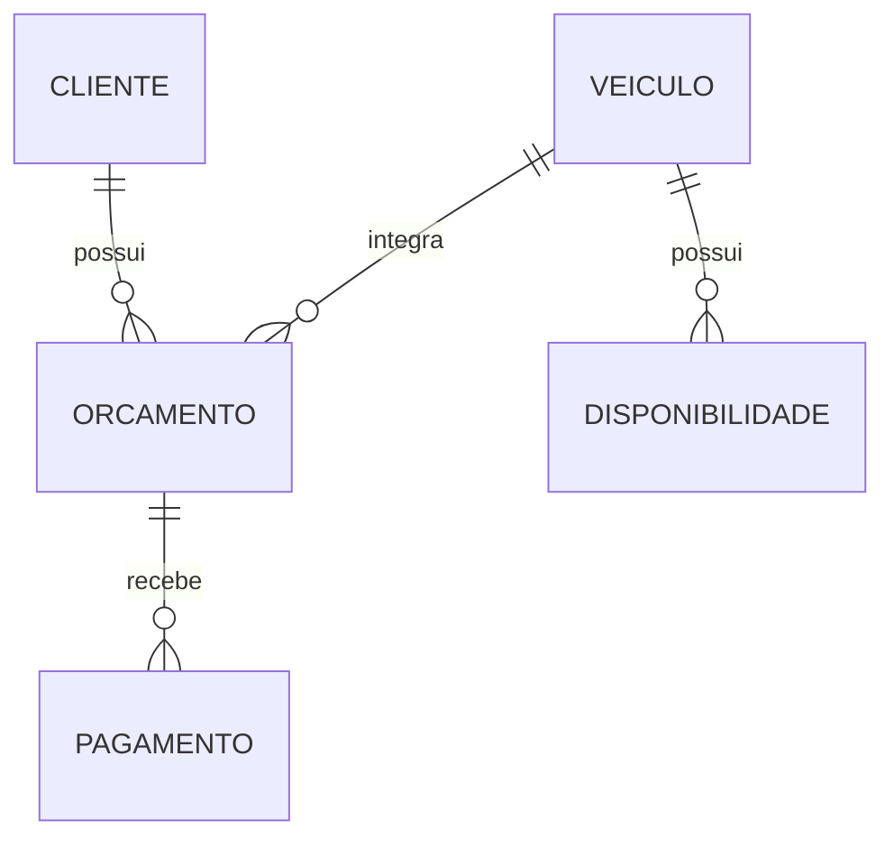

# VeloRent — Gestão de locadora de veículos

Aplicação de console para centralizar cadastros de clientes, frota, disponibilidade, orçamentos e registros de pagamento de uma locadora.

**Java 21 · Hibernate 6.4.4.Final · MySQL · Maven**

Projeto acadêmico desenvolvido em equipe no Bacharelado em Sistemas de Informação da UNIFACOL, para a disciplina de Análise e Projeto Orientado a Objetos (APOO), em 2026.

[Executar localmente](#como-executar) · [Funcionalidades](#funcionalidades) · [Arquitetura](#arquitetura) · [Equipe](#equipe)

## Sobre o projeto

O VeloRent aplica programação orientada a objetos a um cenário de gestão de locações. A proposta é reunir os dados de clientes e veículos, consultar períodos de disponibilidade e registrar orçamentos e pagamentos em um banco relacional.

### O que explorar no código

- **Modelagem:** entidades e relacionamentos de clientes, veículos, orçamentos e pagamentos.
- **Regras de negócio:** validação de períodos e consulta de disponibilidade ao cadastrar orçamentos.
- **Persistência:** acesso ao MySQL com Hibernate e mapeamentos JPA.
- **Organização:** interface de console, serviços e repositórios separados.
- **Acesso:** login e menus que consideram os perfis de administrador e atendente.

## Como executar

### 1. Pré-requisitos

- JDK 21.
- Maven 3.8 ou superior instalado e disponível no terminal.
- MySQL 8 em execução.
- Git.

Verifique o Java e o Maven:

```bash
java -version
mvn -version
```

O Java utilizado pelo Maven também deve ser o JDK 21. Não há Maven Wrapper neste repositório.

### 2. Clonar o repositório

```bash
git clone https://github.com/JLemosDev/Projeto-VeloRent-APOO.git
cd Projeto-VeloRent-APOO
```

### 3. Preparar o banco de dados

Em um cliente MySQL, execute:

```sql
CREATE DATABASE IF NOT EXISTS locadora;
```

Edite [src/main/resources/hibernate.cfg.xml](src/main/resources/hibernate.cfg.xml) com o endereço, usuário e senha do seu banco local. Os campos abaixo são um exemplo; substitua o usuário e a senha antes de executar:

```xml
<property name="hibernate.connection.url">jdbc:mysql://127.0.0.1:3306/locadora?useSSL=false&amp;serverTimezone=America/Recife&amp;allowPublicKeyRetrieval=true</property>
<property name="hibernate.connection.username">SEU_USUARIO_MYSQL</property>
<property name="hibernate.connection.password">SUA_SENHA_MYSQL</property>
```

No XML, mantenha `&amp;` entre os parâmetros da URL. O usuário configurado precisa ter acesso ao banco `locadora` e permissão para criar e atualizar tabelas.

O Hibernate está configurado com `hibernate.hbm2ddl.auto=update`, que cria ou atualiza as tabelas a partir das entidades. O banco `locadora` deve existir antes de iniciar a aplicação.

### 4. Compilar e executar

Na raiz do projeto:

```bash
mvn clean package
java -jar target/POO-2026-01-1.0-SNAPSHOT-jar-with-dependencies.jar
```

O comando de empacotamento usa o Maven Assembly Plugin já configurado no [pom.xml](pom.xml), que inclui as dependências no JAR e define `Main` como ponto de entrada.

A aplicação funciona no terminal. Após conectar ao banco, ela apresenta a tela de login e, depois da autenticação, o menu de módulos.

### 5. Primeiro acesso

Se a tabela de usuários estiver vazia, a aplicação cria uma conta administrativa padrão e mostra as credenciais no terminal. A implementação está em [UsuarioService.java](src/main/java/service/UsuarioService.java).

Após entrar, use **Usuários → Alterar senha de usuário** para trocar a senha da conta. Em execuções posteriores, use as credenciais cadastradas no seu banco.

### Executar pela IDE

1. Importe o `pom.xml` como projeto Maven.
2. Selecione o JDK 21 e aguarde as dependências.
3. Configure o MySQL conforme o passo 3.
4. Execute [src/main/java/Main.java](src/main/java/Main.java).

O diretório de código usado pelo Maven é `src/main/java`. Há outros arquivos Java diretamente em `src/`; use o ponto de entrada acima ao importar ou executar o projeto.

## Roteiro para explorar

1. Entre como administrador e confira os módulos do menu.
2. Cadastre um cliente e um veículo com valor de diária.
3. Explore o cadastro e a consulta de períodos de disponibilidade.
4. Crie um orçamento para o cliente e o veículo, informando início e fim da locação.
5. Consulte o valor estimado e registre um pagamento vinculado ao orçamento.

Use dados fictícios para a demonstração acadêmica. Os pagamentos são registros internos; o projeto não integra um serviço de cobrança.

## Funcionalidades

| Módulo | Recursos |
| --- | --- |
| Login | Autenticação por usuário e senha, com até três tentativas por execução |
| Clientes | Cadastro, edição, exclusão e listagem |
| Veículos | Cadastro, edição, exclusão e listagem |
| Disponibilidade | Registro e consulta de períodos por veículo |
| Orçamentos | Cadastro com verificação de disponibilidade e cálculo de valor pela diária |
| Pagamentos | Registro e consulta de pagamentos vinculados a orçamentos |
| Usuários | Cadastro, alteração de senha, exclusão e listagem em menu de administrador |

### Exemplos de regras no código

- A data inicial de um orçamento deve ser anterior à data final.
- O cadastro de orçamento consulta a disponibilidade do veículo no período.
- O valor estimado usa a quantidade de dias e o valor da diária.
- O login de um novo usuário não pode repetir um cadastro existente.
- O menu de usuários só é apresentado e acionado pelo menu principal para administradores.

## Tecnologias

| Tecnologia | Uso |
| --- | --- |
| Java 21 | Linguagem e programação orientada a objetos |
| Hibernate 6.4.4.Final / JPA | Mapeamento e persistência das entidades |
| MySQL | Banco de dados relacional |
| MySQL Connector/J 8.3.0 | Conexão da aplicação ao banco |
| Maven | Dependências, compilação e empacotamento |

## Arquitetura

```text
UI — menus de console
          ↓
Service — regras de negócio
          ↓
Repository — acesso a dados
          ↓
Hibernate / entidades JPA
          ↓
        MySQL
```

### Estrutura principal

```text
Projeto-VeloRent-APOO/
├── pom.xml
└── src/main/
    ├── java/
    │   ├── Main.java
    │   ├── model/          # Entidades e enums
    │   ├── repository/     # Persistência com Hibernate
    │   ├── service/        # Regras de negócio
    │   ├── ui/             # Login e menus de console
    │   └── util/           # Entrada, senhas e inicialização do Hibernate
    └── resources/
        └── hibernate.cfg.xml
```

### Relacionamentos principais



## Solução de problemas

| Situação | O que conferir |
| --- | --- |
| Maven não encontrado | Instalação do Maven e configuração do `PATH` |
| Erro de versão do Java | JDK exibido por `mvn -version` |
| Falha ao conectar ao MySQL | Serviço em execução, host, porta e nome do banco |
| Acesso negado ao banco | Usuário, senha e permissões em `hibernate.cfg.xml` |
| Erro ao ler a configuração XML | Uso de `&amp;` nos parâmetros da URL |
| JAR não encontrado | Execute `mvn clean package` e confira o resultado em `target/` |

## Verificação e estágio atual

O repositório ainda não contém uma suíte de testes automatizados em `src/test`. A compilação e o empacotamento não substituem a verificação dos fluxos com o banco configurado.

Este é um projeto acadêmico com interface de console. Os relacionamentos e o roteiro de uso estão documentados neste README.

## Equipe

| Nome | Função |
|---|---|
| Alice Flávia Félix Lucena | Documentadora |
| Adrian Gabriel Ferreira Oliveira | Desenvolvedor Front-end |
| Jady Wéllyda de Albuquerque Silva | Desenvolvedora |
| João Vitor Lemos de Souza | Desenvolvedor |
| Luis Henrique dos Anjos Silva | Product Owner |
| Vívian Gabryelle Gomes Lucena Silva | Modeladora de Sistema (UML) |

**Orientadora:** Profª Ana Cristina  
**Instituição:** Centro Universitário UNIFACOL  
**Curso:** Bacharelado em Sistemas de Informação  
**Projeto:** APOO-2026-01

---

## Contexto acadêmico

Projeto desenvolvido para fins educacionais — UNIFACOL, 2026.
