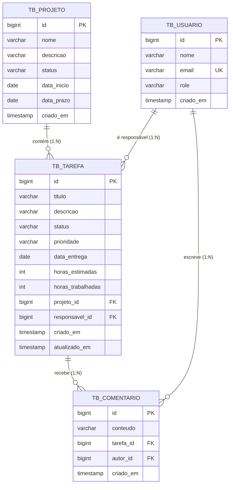
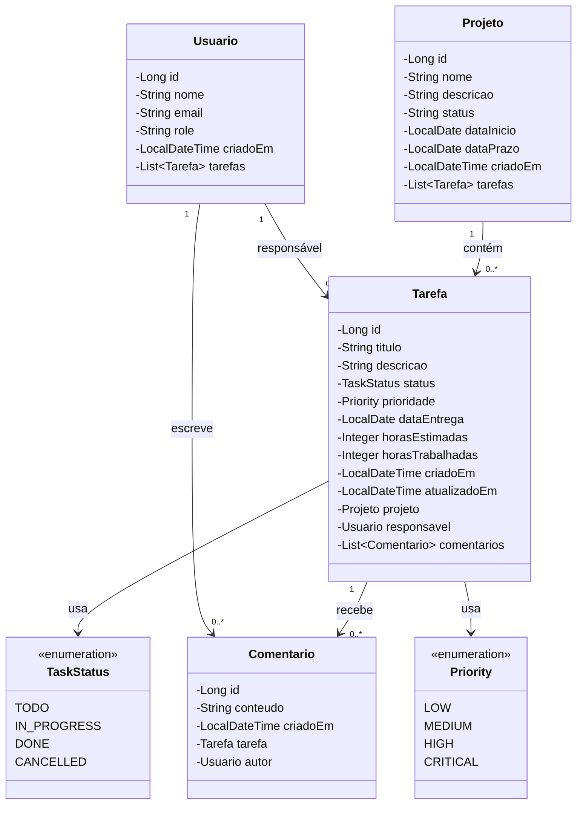

# TaskFlow — Gestão de projetos e tarefas

API REST com interface web para organizar projetos, distribuir tarefas e acompanhar prazos, prioridades e carga de trabalho.

**Java 21 · Spring Boot 3.2.5 · Spring Data JPA · H2 · Maven**

Projeto acadêmico desenvolvido em equipe na disciplina de Programação II, no Centro Universitário FACOL. O código demonstra separação em camadas, validação de dados, regras de negócio e consultas para relatórios.

[Executar localmente](#como-executar) · [Funcionalidades](#funcionalidades) · [Endpoints](#endpoints) · [Arquitetura](#arquitetura) · [Equipe](#equipe)

## Sobre o projeto

O TaskFlow centraliza usuários, projetos, tarefas e comentários. A proposta é facilitar o acompanhamento do trabalho: identificar tarefas atrasadas, consultar o progresso dos projetos e visualizar a distribuição de atividades por responsável.

### O que explorar no código

- **Regras de negócio:** restrições de prazo, prioridade, encerramento de projetos e reatribuição de tarefas.
- **Organização:** controllers, services, repositories e DTOs com responsabilidades separadas.
- **Persistência:** entidades JPA, relacionamentos e consultas SQL para relatórios.
- **Documentação e uso:** Swagger UI, coleção do Postman e interface web incluída no repositório.

## Como executar

### 1. Pré-requisitos

- JDK 21.
- Maven 3.9.x instalado e disponível no terminal.
- Git.

Confira o ambiente:

```bash
java -version
mvn -version
```

O Java utilizado pelo Maven, mostrado em `mvn -version`, também deve ser o JDK 21. Este repositório não inclui Maven Wrapper; os comandos abaixo usam o Maven instalado.

### 2. Clonar e compilar

```bash
git clone https://github.com/JLemosDev/taskflow1v.git
cd taskflow1v
mvn clean verify
```

### 3. Iniciar

Execute na raiz do projeto, onde está o `pom.xml`:

```bash
mvn spring-boot:run
```

A configuração padrão usa **H2 em arquivo**, na pasta `data/`, e preserva os dados entre execuções. Não é necessário instalar um servidor de banco de dados separado.

### 4. Explorar a aplicação

Com a aplicação em execução, abra:

| Recurso | Endereço local |
| --- | --- |
| Interface web | [TaskFlow](http://localhost:8080/taskflow-app.html) |
| Documentação interativa | [Swagger UI](http://localhost:8080/swagger-ui.html) |
| Especificação OpenAPI | [JSON da API](http://localhost:8080/v3/api-docs) |
| Consulta de projetos | [GET /api/projetos](http://localhost:8080/api/projetos) |
| Console do banco | [H2 Console](http://localhost:8080/h2-console) |

Os endereços acima funcionam após iniciar a aplicação na sua máquina.

Para explorar a API, abra o Swagger, execute `GET /api/usuarios` e `GET /api/projetos`, consulte os IDs retornados e use os exemplos de requisição para cadastrar ou atualizar registros. A [coleção do Postman](postman/TaskFlow_API.postman_collection.json) também está disponível.

### Dados de demonstração

O [DataLoader](src/main/java/com/taskflow/config/DataLoader.java) cria 4 usuários, 2 projetos, 7 tarefas e 5 comentários **quando a tabela de usuários está vazia**. Se já houver usuários, a carga é ignorada. Como o repositório contém arquivos de banco em `data/`, o conteúdo inicial de um clone pode refletir dados já salvos.

Para uma demonstração temporária com banco novo em memória, pare a execução anterior e use:

```bash
mvn spring-boot:run "-Dspring-boot.run.arguments=--spring.datasource.url=jdbc:h2:mem:taskflow_demo"
```

Nesse modo, os dados existem somente durante a execução. No H2 Console, use `jdbc:h2:mem:taskflow_demo`.

## Configuração

As propriedades estão em [application.properties](src/main/resources/application.properties).

| Propriedade | Valor no repositório |
| --- | --- |
| `server.port` | `8080` |
| `spring.datasource.url` | `jdbc:h2:file:./data/taskflow_db;DB_CLOSE_DELAY=-1;AUTO_SERVER=TRUE` |
| `spring.datasource.username` | `sa` |
| `spring.datasource.password` | vazio |
| `spring.jpa.hibernate.ddl-auto` | `update` |
| `spring.h2.console.enabled` | `true` |
| `springdoc.swagger-ui.path` | `/swagger-ui.html` |

No H2 Console, copie a URL JDBC da configuração usada na execução, informe o usuário `sa` e deixe a senha em branco.

A interface web aponta para `http://localhost:8080`. Se mudar a porta ou o endereço da API, ajuste também a constante `API` em [taskflow-app.html](src/main/resources/static/taskflow-app.html).

A migração para outro banco exige adicionar o driver correspondente ao `pom.xml`, ajustar as propriedades de conexão e revisar a compatibilidade das consultas nativas.

## Funcionalidades

### CRUD Completo
- **Usuários** — Criar, listar, buscar por ID, atualizar e excluir
- **Projetos** — Criar, listar, filtrar por status, buscar por ID, atualizar e excluir
- **Tarefas** — Criar, listar, buscar por ID, atualização parcial (PATCH) e excluir
- **Comentários** — Criar, listar por tarefa e excluir com validação do ID do solicitante

### Regras de Negócio Implementadas
| Código | Descrição |
|--------|-----------|
| RN-U1 | E-mail de usuário deve ser único no sistema |
| RN-U2 | Usuário com tarefas ativas não pode ser excluído |
| RN-P1 | Nome de projeto deve ser único |
| RN-P2 | Prazo do projeto deve ser posterior à data de início |
| RN-P3 | Projeto CONCLUIDO/CANCELADO não pode ser reaberto para EM_ANDAMENTO |
| RN-P4 | Projeto com tarefas ativas não pode ser excluído |
| RN-P5 | Projeto só é marcado CONCLUIDO se todas as tarefas forem DONE ou CANCELLED |
| RN-T1 | Tarefas não podem ser criadas em projetos finalizados |
| RN-T2 | Data de entrega da tarefa não pode ultrapassar o prazo do projeto |
| RN-T3 | Tarefa DONE/CANCELLED não pode voltar para status TODO |
| RN-T4 | Horas trabalhadas não podem exceder o dobro das horas estimadas |
| RN-T5 | Tarefa com prioridade CRITICAL exige responsável obrigatório |
| RN-T7 | Reatribuição em lote exige que origem e destino sejam usuários distintos |
| RN-C1 | Comentários não são permitidos em tarefas CANCELLED |
| RN-C3 | O ID informado como solicitante deve corresponder ao autor do comentário |

### Consultas Nativas (`nativeQuery = true`)
| # | Query | Caso de Uso |
|---|-------|-------------|
| 1 | Ranking de usuários por tarefas em andamento | Dashboard de carga da equipe |
| 2 | Usuários sobrecarregados (acima de N tarefas ativas) | Balanceamento antes de novas atribuições |
| 3 | Estatísticas de produtividade por usuário | Avaliação de desempenho individual |
| 4 | Progresso consolidado de todos os projetos | Visão executiva do portfólio |
| 5 | Projetos com tarefas atrasadas | Consulta de riscos |
| 6 | Distribuição de tarefas por prioridade no projeto | Planejamento de sprint |
| 7 | Tarefas atrasadas por responsável | Consulta de prazos vencidos |
| 8 | Tarefas críticas sem responsável atribuído | Ação imediata da gestão |
| 9 | Tarefas com desvio de estimativa acima de X% | Retrospectiva de planejamento |
| 10 | UPDATE em lote: reatribuição de tarefas | Desligamento ou realocação de colaborador |
| 11 | Fluxo semanal de criação/conclusão por projeto | Gráfico de burndown/velocidade |
| 12 | Engajamento de comentários por projeto | Relatório de participação da equipe |

### Outros Recursos
- **Reatribuição em lote** — transfere todas as tarefas ativas de um colaborador para outro via `PATCH /api/tarefas/reatribuir`
- **DataLoader** — insere dados de exemplo quando não existem usuários cadastrados
- **Tratamento global de erros** — respostas JSON padronizadas para 400, 404, 409 e 500
- **Swagger UI** com documentação dos endpoints

---

## Endpoints

```
Usuários    →  /api/usuarios
Projetos    →  /api/projetos
Tarefas     →  /api/tarefas
Comentários →  /api/comentarios
```

### Principais endpoints por recurso

**Usuários**
```
POST   /api/usuarios                              → Criar usuário
GET    /api/usuarios                              → Listar todos
GET    /api/usuarios/{id}                         → Buscar por ID
PUT    /api/usuarios/{id}                         → Atualizar
DELETE /api/usuarios/{id}                         → Excluir
GET    /api/usuarios/relatorios/ranking-andamento → Ranking por carga
GET    /api/usuarios/relatorios/sobrecarregados   → Usuários sobrecarregados
GET    /api/usuarios/{id}/relatorios/produtividade→ Estatísticas individuais
```

**Projetos**
```
POST   /api/projetos                              → Criar projeto
GET    /api/projetos                              → Listar todos
GET    /api/projetos/{id}                         → Buscar por ID
GET    /api/projetos/status?status=EM_ANDAMENTO   → Filtrar por status
PUT    /api/projetos/{id}                         → Atualizar
DELETE /api/projetos/{id}                         → Excluir
GET    /api/projetos/relatorios/progresso         → Progresso do portfólio
GET    /api/projetos/relatorios/em-risco          → Projetos com atraso
GET    /api/projetos/{id}/relatorios/prioridades  → Distribuição por prioridade
```

**Tarefas**
```
POST   /api/tarefas                               → Criar tarefa
GET    /api/tarefas                               → Listar todas
GET    /api/tarefas/{id}                          → Buscar por ID
GET    /api/tarefas/projeto/{projetoId}           → Tarefas do projeto
GET    /api/tarefas/responsavel/{usuarioId}       → Tarefas do responsável
PATCH  /api/tarefas/{id}                          → Atualização parcial
DELETE /api/tarefas/{id}                          → Excluir
PATCH  /api/tarefas/reatribuir?origemId=&destinoId= → Reatribuição em lote
GET    /api/tarefas/relatorios/atrasadas/{id}     → Tarefas atrasadas
GET    /api/tarefas/relatorios/criticas-sem-responsavel → Alertas críticos
GET    /api/tarefas/relatorios/desvio-estimativa  → Desvio de planejamento
```

**Comentários**
```
POST   /api/comentarios                           → Criar comentário
GET    /api/comentarios/tarefa/{tarefaId}         → Listar por tarefa
DELETE /api/comentarios/{id}?solicitanteId=       → Excluir com validação do solicitante
GET    /api/comentarios/relatorios/engajamento/{projetoId} → Engajamento
```

---

## Arquitetura

```text
Interface web / cliente HTTP
            ↓
        Controller
            ↓
         Service
            ↓
        Repository
            ↓
       JPA / Hibernate
            ↓
         Banco H2
```

Os DTOs organizam as entradas e saídas da API; o tratamento global de exceções padroniza as respostas de erro.

```text
taskflow1v/
├── pom.xml
├── data/                          # Banco H2 em arquivo
├── postman/                       # Coleção de requisições
└── src/main/
    ├── java/com/taskflow/
    │   ├── config/                # OpenAPI e dados de exemplo
    │   ├── controller/            # Endpoints HTTP
    │   ├── dto/                   # Objetos de entrada e saída
    │   ├── exception/             # Tratamento de erros
    │   ├── model/                 # Entidades e enums
    │   ├── repository/            # Persistência e consultas
    │   └── service/               # Regras de negócio
    └── resources/
        ├── application.properties
        └── static/taskflow-app.html
```

<details>
<summary>Ver diagramas de casos de uso, dados e classes</summary>

Os atores do diagrama representam o modelo conceitual do projeto. A versão atual da API não implementa autenticação de usuários; os perfis e o ID do solicitante não equivalem a uma sessão autenticada.

## 📊 Diagrama de Casos de Uso

```mermaid
%%{init: {'theme': 'base', 'themeVariables': { 'primaryColor': '#4A90D9', 'primaryTextColor': '#fff', 'primaryBorderColor': '#2C5F8A', 'lineColor': '#555', 'secondaryColor': '#f4f4f4'}}}%%
graph TD
    subgraph Atores
        G(["👤 Gerente"])
        M(["👤 Membro"])
        A(["👤 Admin"])
    end

    subgraph Sistema TaskFlow
        subgraph "Gestão de Projetos"
            UC1["Criar Projeto"]
            UC2["Atualizar Projeto"]
            UC3["Excluir Projeto"]
            UC4["Visualizar Progresso"]
            UC5["Ver Projetos em Risco"]
        end

        subgraph "Gestão de Tarefas"
            UC6["Criar Tarefa"]
            UC7["Atualizar Status da Tarefa"]
            UC8["Registrar Horas Trabalhadas"]
            UC9["Atribuir Responsável"]
            UC10["Reatribuir Tarefas em Lote"]
            UC11["Excluir Tarefa"]
        end

        subgraph "Colaboração"
            UC12["Comentar em Tarefa"]
            UC13["Excluir Próprio Comentário"]
            UC14["Listar Comentários"]
        end

        subgraph "Relatórios"
            UC15["Ver Carga da Equipe"]
            UC16["Ver Tarefas Atrasadas"]
            UC17["Ver Desvio de Estimativa"]
            UC18["Ver Engajamento da Equipe"]
        end

        subgraph "Gestão de Usuários"
            UC19["Cadastrar Usuário"]
            UC20["Atualizar Usuário"]
            UC21["Excluir Usuário"]
        end
    end

    G --> UC1
    G --> UC2
    G --> UC3
    G --> UC4
    G --> UC5
    G --> UC6
    G --> UC9
    G --> UC10
    G --> UC15
    G --> UC16
    G --> UC17
    G --> UC18

    M --> UC7
    M --> UC8
    M --> UC12
    M --> UC13
    M --> UC14
    M --> UC16

    A --> UC19
    A --> UC20
    A --> UC21
    A --> UC10
```



---

## 🗄️ Diagrama Entidade-Relacionamento (DER)



---

## 📐 Diagrama de Classes (Entidades + Relacionamentos)



---

</details>

## Verificação e estágio atual

- `mvn clean verify` compila e empacota o projeto. O repositório ainda não contém uma suíte de testes automatizados em `src/test`.
- A interface web, o Swagger e o Postman permitem explorar manualmente os fluxos.
- Os relatórios são consultas da API; não há envio automático de notificações implementado.
- O projeto tem finalidade acadêmica. Autenticação, testes automatizados e configuração de implantação são possibilidades de evolução.

## Equipe

- Alice Flávia Félix Lucena
- Jady Wéllyda de Albuquerque Silva
- João Vitor Lemos de Souza
- José Kayo Matheus Ferreira e Silva
- Luis Henrique dos Anjos Silva
- Vívian Gabryelle Gomes Lucena Silva

**Disciplina:** Programação II  
**Instituição:** Centro Universitário FACOL  
**Semestre:** 2025.1

---

## Contexto acadêmico

O grupo utilizou um quadro Kanban para organizar as atividades. O link público do quadro não está disponível neste repositório.

